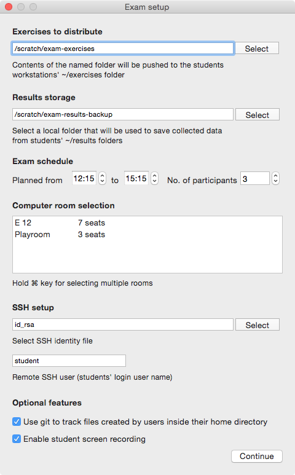
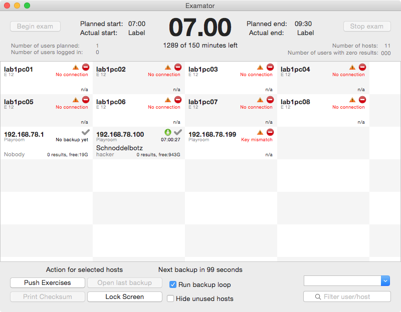

Examator
========

`Examator` - a OS X GUI for SSH based classroom management.

Implemented in [Swift](https://developer.apple.com/swift/), relying on
[Grand Central Dispatch](http://en.wikipedia.org/wiki/Grand_Central_Dispatch) 
and [libssh](http://www.libssh.org/) for SSH remote monitoring/execution and
file transfers in both directions.

The idea behind Examator is to use the Mac to efficiently monitor and
control a bigger bunch of workstations via GUI while integrating zero-brainer
continous remote backup for a specified students' result folder.

But, still ... just a **pure fun project** to get into Swift.

> Warning
>> Examator is incomplete. The GUI and GCD-libssh seem to work, but no more.

Screenshots? Screenshots.





ideas and status
================

 - [x] pure Swift/C app, no external tools/processes involved
 - [x] JSON-based, .app-included room/host configuration data
 - [x] fully KVO-enabled CollectionView that displays/updates client view
 - [x] using .app prefs to store last settings and provide defaults
 - [x] libshh retreived and built automatically and bundled with .app
 - [x] basic working bridging between libssh (C) and swift
 - [x] basically working, GCD-threaded libssh remote command execution, yeah
 - [ ] improve setup 'form validation' / feedback -- use sane values for tests!
 - [ ] push exercises folder to clients
 - [ ] backup loop -- use libssh to retreive students' ~/results folders
 - [ ] print result file checksum sheet for student signing purposes
 - [ ] document/define req'd JSON format, add missing things like printers
 - [ ] create/display md5 checksums for results; print sheets
 - [ ] double-click/right-click client to view/restore any backup

more mixed ideas/bugs/RFEs
==========================

- after stop, allow start. just reset time info
- write to logfile, add button / menu item to show it
- if drag-drop files/folders on client(s?), ask whether to push 'em'
- print testpage -- in every room associated
- allow to override default-printqueue-is-room via menu
- option: swap realname by checksum for beamers...?
- the room label could be hidden if single-room; bind computed property?
- healthchecks to perform and provide visual feedback:
  * ensure every hostname has entry in /etc/hosts, warn otherwise
  * sysstat remote: diskfree, memfree, dmesg?
  * diskfree local
  * cpu load local

building
========

Tested only on Yosemite with Xcode 6.1.1. Requires cmake (to build libssh),
eg. via homebrew. From the source directory, try either

```
$ xcodebuild
$ open build/Release/Examator.app
```
or
```
$ open Examator.xcodeproj
```

and hit the play button.

The included example [roomdata.json](Examator/roomdata.json) has to be
adjusted to your lab environment. The example contains only 10 records -- but
Examator wants to be designed to support 500 clients without problem...

license
=======

As libssh is bundled during build, and libssh is under GPL... is there much choice? The icon-placeholders have been stolen from unison; I'll return them ASAP.

